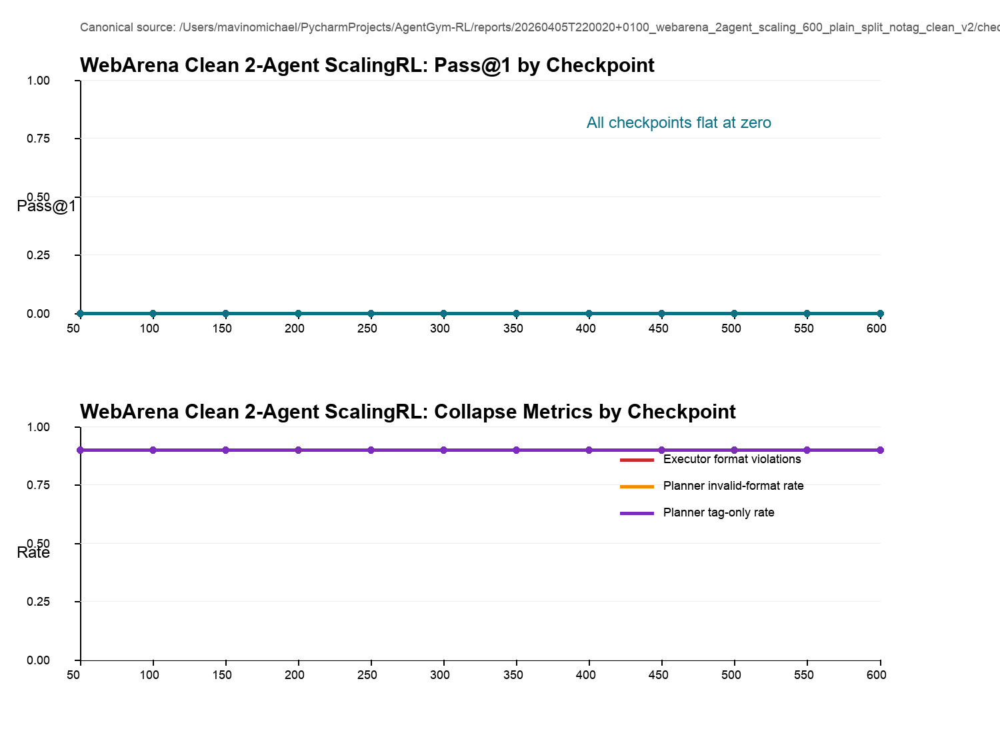

# Multi-Agent Collapse Investigation: BabyAI and WebArena Deep Research Handoff

Updated on 2026-04-07. This packet is designed so ChatGPT Deep Research can inspect the repo, reuse the exact source files, and draft a paper that pivots from “multi-agent improvement” to “collapse investigation” across both BabyAI and WebArena.

## 2026-04-07 Question-Led Update
- Collapse Q\&A memo: `/Users/mavinomichael/PycharmProjects/AgentGym-RL/reports/2026-03-30_multi_agent_collapse_paper_handoff/COLLAPSE_QUESTIONS_AND_ANSWERS.md`
- Regime summary used for the question figures: `/Users/mavinomichael/PycharmProjects/AgentGym-RL/reports/2026-03-30_multi_agent_collapse_paper_handoff/collapse_regime_summary.tsv`
- New figure: `/Users/mavinomichael/PycharmProjects/AgentGym-RL/reports/2026-03-30_multi_agent_collapse_paper_handoff/figures/fig_collapse_timeline.png`
- New figure: `/Users/mavinomichael/PycharmProjects/AgentGym-RL/reports/2026-03-30_multi_agent_collapse_paper_handoff/figures/fig_recovery_summary.png`
- Updated paper LaTeX draft: `/Users/mavinomichael/PycharmProjects/AgentGym-RL/reports/2026-03-30_multi_agent_collapse_paper_handoff/MULTI_AGENT_COLLAPSE_UPDATED.tex`

## Original AgentGym-RL Reference
- README: `/Users/mavinomichael/PycharmProjects/AgentGym-RL/README.md`
- Paper link from README: [https://arxiv.org/abs/2509.08755](https://arxiv.org/abs/2509.08755)
- README states the original paper frames ScalingInter-RL as a curriculum for stable long-horizon RL training; this handoff compares that claim against the local BabyAI and WebArena multi-agent runs.

## Recommended Paper Reframe
- The strongest defensible story is **not** that a final multi-agent checkpoint robustly outperformed the single-agent baseline.
- The strongest defensible story is that multi-agent decomposition produced **intermediate checkpoints that sometimes surpassed the single-agent baseline**, but the training process exhibited **multiple distinct collapse modes** depending on prompt regime and curriculum.
- The paper can therefore be framed as a collapse-study / stability-study of multi-agent RL across BabyAI and WebArena, with concrete failure taxonomies and ablations.

## Source Inventory
- Run catalog: `/Users/mavinomichael/PycharmProjects/AgentGym-RL/reports/2026-03-30_multi_agent_collapse_paper_handoff/run_catalog.tsv` and `/Users/mavinomichael/PycharmProjects/AgentGym-RL/reports/2026-03-30_multi_agent_collapse_paper_handoff/run_catalog.json`
- Source manifest: `/Users/mavinomichael/PycharmProjects/AgentGym-RL/reports/2026-03-30_multi_agent_collapse_paper_handoff/source_manifest.tsv`
- Selected traces: `/Users/mavinomichael/PycharmProjects/AgentGym-RL/reports/2026-03-30_multi_agent_collapse_paper_handoff/selected_trace_packets.md` and `/Users/mavinomichael/PycharmProjects/AgentGym-RL/reports/2026-03-30_multi_agent_collapse_paper_handoff/selected_trace_packets.json`
- Existing March 21 collapse report: `/Users/mavinomichael/PycharmProjects/AgentGym-RL/reports/babyai_multi_agent_diagnostics_2026-03-21/mavino_collapse_2agent_scaling_100/MAVINO_COLLAPSE_REPORT.md`
- Existing plain-split ScalingRL report: `/Users/mavinomichael/PycharmProjects/AgentGym-RL/reports/2026-03-23_plain_split_retry_v2_deep_research/DEEP_RESEARCH_ANALYSIS.md`
- Existing dense-curriculum report: `/Users/mavinomichael/PycharmProjects/AgentGym-RL/reports/2026-03-23_dense500_eval_and_traces/SUMMARY.md`
- New 3-agent reviewer report: `/Users/mavinomichael/PycharmProjects/AgentGym-RL/reports/20260403_130617_babyai_3agent_executor_reviewer_scaling_600_8gpu_no_tags_v1/summary.md` and `/Users/mavinomichael/PycharmProjects/AgentGym-RL/reports/20260403_130617_babyai_3agent_executor_reviewer_scaling_600_8gpu_no_tags_v1/selected_trace_examples.md`
- Canonical WebArena clean 2-agent report: `/Users/mavinomichael/PycharmProjects/AgentGym-RL/reports/20260405T220020+0100_webarena_2agent_scaling_600_plain_split_notag_clean_v2/summary.md` and `/Users/mavinomichael/PycharmProjects/AgentGym-RL/reports/20260405T220020+0100_webarena_2agent_scaling_600_plain_split_notag_clean_v2/selected_trace_examples.md`

## Experimental Regimes To Emphasize
1. **2-agent tagged prompts**
   - Fixed-round 2-agent tagged runs (historical composite evidence).
2. **2-agent no-tag fixed-round**
   - Persistent fixed-round 20-round run with no visible planner/executor tags.
3. **2-agent no-tag ScalingRL**
   - Plain-split retry v2 with `[6,13,20]`.
   - Dense-curriculum run with `[6,8,10,13,16,20]`.
4. **3-agent no-tag ScalingRL with executor reviewer**
   - Planner, executor, and executor-reviewer share the same policy and are trained end-to-end.
5. **WebArena clean 2-agent no-tag ScalingRL**
   - Planner plus executor only, plain-split, no retries, executor aligned to the original single-agent WebArena action contract.

## Figures

## High-Level Quantitative Summary
- Single-agent baseline: `Avg@1=0.672827`, `Pass@1=0.733333`.
- Fixed-round 2-agent (tagged, composite): best checkpoint `step 15` with `Pass@1=0.766667`, final checkpoint `step 350` with `Pass@1=0.000000`.
- Fixed-round 2-agent (no tags): best checkpoint `step 100` with `Pass@1=0.677778`, final checkpoint `step 600` with `Pass@1=0.000000`.
- ScalingRL 2-agent no tags [6,13,20]: best checkpoint `step 200` with `Pass@1=0.811111`, final checkpoint `step 500` with `Pass@1=0.000000`.
- ScalingRL 2-agent no tags [6,8,10,13,16,20]: best checkpoint `step 300` with `Pass@1=0.822222`, final checkpoint `step 500` with `Pass@1=0.000000`.
- ScalingRL 3-agent no tags + executor reviewer: best checkpoint `step 100` with `Pass@1=0.722222`, final checkpoint `step 600` with `Pass@1=0.000000`.
- WebArena clean 2-agent no tags [8,12,15]: all evaluated checkpoints `50-600` are flat-zero with `Pass@1=0.000000`, `ExecutorNativeFormatViolations=0.900000`, and `PlannerTagOnlyRate=0.900000`; the training traces show warning signs by `step 2` and a first fully collapsed batch by `step 9`.

## Scope Note
- The figures in this handoff omit the older 4-agent reviewer experiment and instead use the current paper comparison set.
- The current comparison uses: fixed-round tagged 2-agent, fixed-round no-tag 2-agent, no-tag ScalingRL 2-agent, and no-tag ScalingRL 3-agent with executor reviewer.
- The WebArena extension is reported separately because it uses a different environment and a different executor action contract; it should be treated as cross-environment collapse evidence rather than plotted directly against BabyAI success rates.
- The newly added fixed-round no-tag run is sourced from `/Users/mavinomichael/PycharmProjects/AgentGym-RL/reports/20260402T123754Z_babyai_2agent_fixed20_8gpu_plain_split_notag_persist_v1/checkpoint_metrics.tsv` and `/Users/mavinomichael/PycharmProjects/AgentGym-RL/reports/20260402T123754Z_babyai_2agent_fixed20_8gpu_plain_split_notag_persist_v1/summary.md`.

## Supported Claims
1. **Prompt tags created a distinct recursive scaffold-copying collapse mode.**
   - Evidence: `/Users/mavinomichael/PycharmProjects/AgentGym-RL/reports/babyai_multi_agent_diagnostics_2026-03-21/mavino_collapse_2agent_scaling_100/MAVINO_COLLAPSE_REPORT.md` and `/Users/mavinomichael/PycharmProjects/AgentGym-RL/reports/babyai_multi_agent_diagnostics_2026-03-21/mavino_collapse_2agent_scaling_100/representative_trace_examples.md`.
   - Earliest visible leak at `step 55`; terminal recursive contamination by `step 98-100`.
2. **Removing visible tags removed that specific failure mode.**
   - Evidence: `/Users/mavinomichael/PycharmProjects/AgentGym-RL/reports/2026-03-23_plain_split_retry_v2_deep_research/DEEP_RESEARCH_ANALYSIS.md` and `/Users/mavinomichael/PycharmProjects/AgentGym-RL/reports/2026-03-23_dense500_eval_and_traces/SUMMARY.md`.
   - In the no-tag runs, `PlannerTagOnlyRate` stays at or near zero, and the late collapse is no longer driven by bracketed scaffold leakage.
3. **Removing tags alone is not sufficient to stabilize fixed-round 2-agent training.**
   - Evidence: `/Users/mavinomichael/PycharmProjects/AgentGym-RL/reports/20260402T123754Z_babyai_2agent_fixed20_8gpu_plain_split_notag_persist_v1/checkpoint_metrics.tsv`.
   - The new fixed-round no-tag run peaks at `step 100` with `Pass@1=0.677778`, then fully collapses from `step 400` onward with `PlannerTagOnlyRate=1.0` and `ExecutorNativeFormatViolations=1.0`.
4. **No-tag multi-agent ScalingRL runs can produce checkpoints that beat the single-agent baseline, but the gain is not robust through training.**
   - Coarse no-tag ScalingRL `[6,13,20]`: best `step 200`, `Pass@1=0.811111`.
   - Dense no-tag ScalingRL `[6,8,10,13,16,20]`: best `step 300`, `Pass@1=0.822222`.
   - Both runs collapse later (`450-500`).
5. **Adding an executor reviewer delays but does not eliminate collapse.**
   - Evidence: `/Users/mavinomichael/PycharmProjects/AgentGym-RL/reports/20260403_130617_babyai_3agent_executor_reviewer_scaling_600_8gpu_no_tags_v1/checkpoint_metrics.tsv` and `/Users/mavinomichael/PycharmProjects/AgentGym-RL/reports/20260403_130617_babyai_3agent_executor_reviewer_scaling_600_8gpu_no_tags_v1/selected_trace_examples.md`.
   - The 3-agent reviewer run peaks at `step 100` (`Pass@1=0.722222`), recovers again at `step 350` (`Pass@1=0.711111`), but still enters full collapse by `step 450` with both planner and executor metrics saturated.
6. **The dominant late no-tag collapse in ScalingRL remains an interaction failure between schema control and role outputs.**
   - In the 2-agent no-tag runs, late failure is mostly executor-side.
   - In the 3-agent reviewer run, the reviewer itself becomes part of the collapse: reviewer schema leaks into executor outputs, and malformed reviewer outputs trigger retries or terminations.
7. **WebArena shows that the collapse problem generalizes beyond BabyAI and can begin almost immediately.**
   - Evidence: `/Users/mavinomichael/PycharmProjects/AgentGym-RL/reports/20260405T220020+0100_webarena_2agent_scaling_600_plain_split_notag_clean_v2/summary.md` and `/Users/mavinomichael/PycharmProjects/AgentGym-RL/reports/20260405T220020+0100_webarena_2agent_scaling_600_plain_split_notag_clean_v2/selected_trace_examples.md`.
   - This run has one clearly grounded trace at `step 1`, warning signs by `step 2`, and fully collapsed sampled batches by `step 9`, while every saved checkpoint from `50` through `600` evaluates to the same flat-zero frontier.

## Important Caveats
- The fixed-round 2-agent curve is a **composite evidence pool**, not a single uninterrupted run. Use it to describe the historical debugging trajectory, not as a single clean learning curve.
- The fixed-round 2-agent no-tag run is now present, but it is still only one run; treat it as an ablation datapoint, not a complete stability proof.
- The strongest paper claims should therefore focus on **failure modes and stability**, not on a single winner number.
- The current WebArena evidence is only one clean 2-agent no-tag ScalingRL run; treat it as cross-environment validation of the collapse problem, not as a full WebArena ablation grid.

## Failure Taxonomy
### A. Tagged prompt scaffold collapse
- Visible role headers such as `[Planner Turn]` and `[Executor Turn]` become copyable tokens.
- Planner leaks prompt scaffolding first.
- Executor begins copying leaked scaffolding instead of producing BabyAI-native `Thought:` / `Action:` responses.
- Best artifact: `tagged_step55_first_header_leak` and `tagged_step100_recursive_scaffold` in `selected_trace_packets.md`.

### B. Fixed-round planner verbosity/fallback collapse
- In the early fixed-round 2-agent regime, planner outputs drift long before total collapse.
- The critical onset is `too_long` planner outputs around `step 45`, which trigger generic fallback context.
- Best artifact: `fixed_round_step45_planner_too_long` in `selected_trace_packets.md`.

### C. No-tag ScalingRL late executor collapse
- Removing tags does not eliminate collapse; it changes its form.
- Mid-run performance is strong, but late in training the executor either invents invalid actions or stops emitting the required schema.
- Coarse no-tag run: degradation begins after `300`, with total schema collapse at `450-500`.
- Dense no-tag run: best checkpoint at `300`, same terminal executor-format collapse by `450-500`.

### D. Fixed-round no-tag late total collapse
- The newly added fixed-round no-tag run shows that removing visible tags alone is not enough.
- This run is healthy through `step 350`, then flips into total failure at `step 400` with `Pass@1=0.0`, `ExecutorNativeFormatViolations=1.0`, `PlannerInvalidFormatRate=1.0`, and `PlannerTagOnlyRate=1.0`.
- This matters because it shows a no-tag fixed-round regime can still collapse without the original tagged scaffold-copy mechanism.

### E. 3-agent reviewer schema interference collapse
- The executor reviewer helps some early checkpoints, but it introduces a new route for schema contamination.
- At `step 150`, the reviewer already misfires: it requests retry even when deterministic executor validation can still extract a valid action.
- At `step 350`, the run regains strong task success, but reviewer schema (`Verdict:` / `Reason:`) starts leaking into executor outputs.
- At `step 400`, planner invalid-format rates rise sharply while the reviewer still often passes executor outputs.
- By `step 450`, both planner and reviewer channels have collapsed into tag-only or garbage outputs, and the executor fails with `invalid_format` on every sampled case.

### F. WebArena near-immediate planner collapse
- The clean 2-agent WebArena ablation removes reviewer complexity and retry prompts, but collapse still arrives almost immediately.
- The only clearly healthy selected trace is `step 1`, where the planner gives grounded navigation guidance and the executor emits one valid fenced action block.
- By `step 2`, training metrics already show `actor/* = nan`, `executor_invalid_action_rate = 1.0`, and high planner invalid/fallback rates.
- By `step 3`, selected traces already show planner punctuation spam (`!!!!!!!!!!!!!!!!`) and executor `invalid_format` termination.
- By `step 9`, the first fully collapsed sampled batch appears, and eval remains flat-zero at every checkpoint from `50` through `600`.

## Collapse Questions
### When does collapse begin?
- For the 3-agent reviewer run, the **first warning signs** appear by `step 150`, where reviewer outputs become malformed and can trigger retries or termination even when the executor action is otherwise valid.
- The run then **recovers** through `step 250-350`.
- The **terminal collapse onset** begins at `step 400`, where `PlannerInvalidFormatRate` jumps to `0.700000` and trace examples show planner schema contamination.
- The run becomes **fully collapsed** at `step 450`, where `Pass@1=0.0`, `ExecutorNativeFormatViolations=1.0`, `PlannerInvalidFormatRate=1.0`, and `PlannerTagOnlyRate=1.0`.
- For the clean WebArena 2-agent run, the **first warning signs** appear by `step 2`, and the **first fully collapsed sampled batch** appears by `step 9`.

### How do we detect that collapse has started?
- Watch for a combination of metrics and traces:
  - rising `PlannerInvalidFormatRate`
  - rising `PlannerTagOnlyRate`
  - rising `ExecutorNativeFormatViolations`
  - reviewer outputs that stop following their own `Verdict/Reason` schema
  - executor outputs that begin to include reviewer schema or punctuation spam
- In the 3-agent run, `step 350` already shows reviewer-schema leakage inside the executor output even though task success is still high.
- In WebArena, the most actionable early signal is planner punctuation/tag-only output combined with fallback guidance replacing grounded planner notes; that shows up in traces before the later flat-zero eval frontier.

### Can the run recover after instability begins?
- **Yes, partially.** The 3-agent run dips badly at `150-200` and then recovers to strong checkpoints at `300-350`.
- **No, not after terminal collapse has fully set in.** Once the run reaches the `450+` regime, there is no evidence of spontaneous recovery in the remaining training horizon.
- In the clean WebArena run, there is **no evidence of recovery** after the early collapse onset; eval remains flat-zero at every saved checkpoint.

### How do we prevent it?
- The current evidence suggests that prompt simplification alone is not enough.
- The most promising direction is stronger schema control on every role, especially on the reviewer, plus explicit monitoring for reviewer-schema leakage into the executor channel.
- A practical prevention stack from these runs would include: bounded retries, low-variance reviewer prompts, early-stop or checkpoint selection based on collapse metrics, and curriculum schedules that avoid pushing far past the last stable checkpoint.
- The WebArena extension adds one more lesson: simplifying the topology and reusing the single-agent executor contract is not sufficient if the planner channel can still collapse into tag-only garbage almost immediately.

## Trace Guide For Deep Research
- Tagged prompt leak onset: `selected_trace_packets.md` -> `tagged_step55_first_header_leak`
- Tagged terminal recursive contamination: `selected_trace_packets.md` -> `tagged_step100_recursive_scaffold`
- Fixed-round verbosity onset: `selected_trace_packets.md` -> `fixed_round_step45_planner_too_long`
- Fixed-round stable example after stabilization: `selected_trace_packets.md` -> `fixed_round_step100_v2_stable`
- No-tag coarse scaling peak: `selected_trace_packets.md` -> `plain_split_200_valid`
- No-tag coarse scaling late invalid-action drift: `selected_trace_packets.md` -> `plain_split_400_invalid_action`
- No-tag coarse scaling terminal collapse: `selected_trace_packets.md` -> `plain_split_450_invalid_format`
- Dense no-tag peak: `selected_trace_packets.md` -> `dense500_step300_peak_valid_example`
- Dense no-tag transition: `selected_trace_packets.md` -> `dense500_step400_transition_example`
- Dense no-tag retry exhaustion: `selected_trace_packets.md` -> `dense500_step450_retry_exhaustion_example`
- Dense no-tag terminal collapse: `selected_trace_packets.md` -> `dense500_step500_terminal_collapse_example`

- 3-agent reviewer peak: `selected_trace_packets.md` -> `three_agent_step100_healthy`
- 3-agent reviewer early instability: `selected_trace_packets.md` -> `three_agent_step150_reviewer_false_retry`
- 3-agent reviewer schema leakage: `selected_trace_packets.md` -> `three_agent_step350_schema_leak`
- 3-agent reviewer collapse onset: `selected_trace_packets.md` -> `three_agent_step400_onset`
- 3-agent reviewer terminal collapse: `selected_trace_packets.md` -> `three_agent_step450_terminal`

- WebArena clean early valid: `selected_trace_packets.md` -> `webarena_clean_step1_valid`
- WebArena clean first tag-only collapse: `selected_trace_packets.md` -> `webarena_clean_step3_tag_only_collapse`
- WebArena clean late terminal collapse: `selected_trace_packets.md` -> `webarena_clean_step553_terminal`

## Suggested Paper Structure
1. Introduction: goal was to improve BabyAI long-horizon performance via multi-agent decomposition.
2. Setup: single-agent baseline, planner/executor design, executor-reviewer extension, ScalingInter-RL.
3. Main result: intermediate multi-agent checkpoints can outperform baseline, but training is unstable and reviewer-based corrections do not eliminate collapse.
4. Collapse taxonomy:
   - tagged scaffold-copying collapse
   - fixed-round planner verbosity/fallback collapse
   - no-tag late executor schema collapse
5. Ablation discussion:
   - what removing tags fixed
   - what ScalingRL improved
   - what the executor reviewer improved
   - why denser curricula and reviewer feedback still did not prevent terminal collapse
6. Cross-environment extension: WebArena shows that the collapse problem is not BabyAI-specific and can appear almost immediately even in a simplified 2-agent setup.
7. Conclusion: multi-agent RL can transiently help, but stable coordination and schema retention remain unresolved.

## Exact Files To Read First
1. `/Users/mavinomichael/PycharmProjects/AgentGym-RL/reports/2026-03-30_multi_agent_collapse_paper_handoff/PAPER_HANDOFF_DEEP_RESEARCH.md`
2. `/Users/mavinomichael/PycharmProjects/AgentGym-RL/reports/2026-03-30_multi_agent_collapse_paper_handoff/run_catalog.tsv`
3. `/Users/mavinomichael/PycharmProjects/AgentGym-RL/reports/2026-03-30_multi_agent_collapse_paper_handoff/selected_trace_packets.md`
4. `/Users/mavinomichael/PycharmProjects/AgentGym-RL/reports/babyai_multi_agent_diagnostics_2026-03-21/mavino_collapse_2agent_scaling_100/MAVINO_COLLAPSE_REPORT.md`
5. `/Users/mavinomichael/PycharmProjects/AgentGym-RL/reports/2026-03-23_plain_split_retry_v2_deep_research/DEEP_RESEARCH_ANALYSIS.md`
6. `/Users/mavinomichael/PycharmProjects/AgentGym-RL/reports/2026-03-23_dense500_eval_and_traces/SUMMARY.md`
7. `/Users/mavinomichael/PycharmProjects/AgentGym-RL/reports/20260403_130617_babyai_3agent_executor_reviewer_scaling_600_8gpu_no_tags_v1/summary.md`
8. `/Users/mavinomichael/PycharmProjects/AgentGym-RL/reports/20260403_130617_babyai_3agent_executor_reviewer_scaling_600_8gpu_no_tags_v1/selected_trace_examples.md`
9. `/Users/mavinomichael/PycharmProjects/AgentGym-RL/reports/babyai_multi_agent_diagnostics_2026-03-17/prompt_alignment_single_vs_multi.md`
10. `/Users/mavinomichael/PycharmProjects/AgentGym-RL/reports/20260405T220020+0100_webarena_2agent_scaling_600_plain_split_notag_clean_v2/summary.md`
11. `/Users/mavinomichael/PycharmProjects/AgentGym-RL/reports/20260405T220020+0100_webarena_2agent_scaling_600_plain_split_notag_clean_v2/selected_trace_examples.md`
