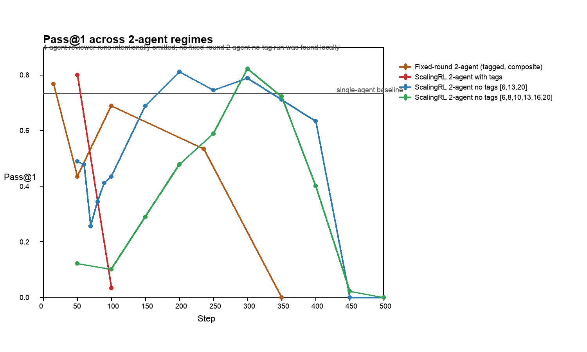
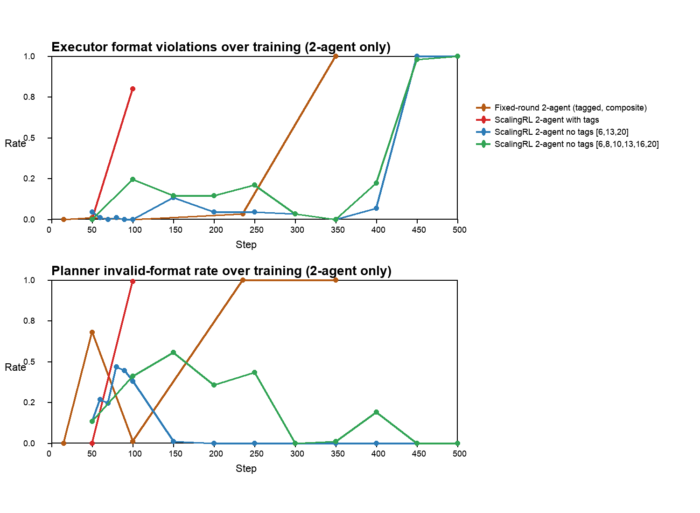
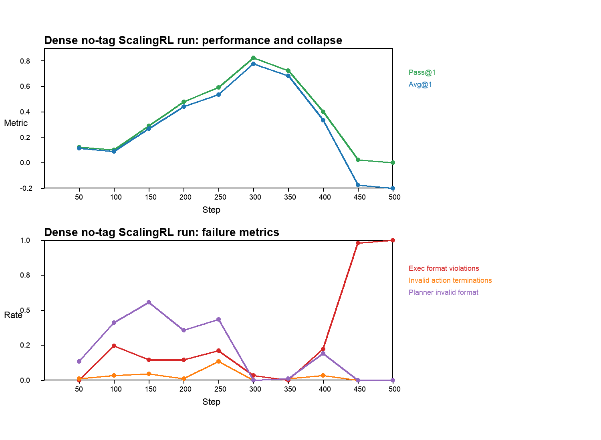
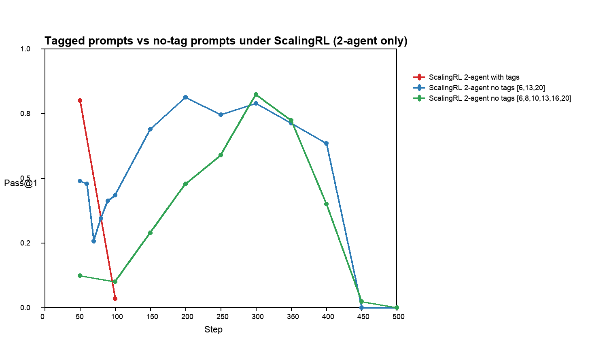

# Multi-Agent BabyAI Collapse Investigation: Deep Research Handoff

Generated on 2026-03-30. This packet is designed so ChatGPT Deep Research can inspect the repo, reuse the exact source files, and draft a paper that pivots from “multi-agent improvement” to “collapse investigation”.

## Original AgentGym-RL Reference
- README: `/Users/mavinomichael/PycharmProjects/AgentGym-RL/README.md`
- Paper link from README: [https://arxiv.org/abs/2509.08755](https://arxiv.org/abs/2509.08755)
- README states the original paper frames ScalingInter-RL as a curriculum for stable long-horizon RL training; this handoff compares that claim against the local BabyAI multi-agent runs.

## Recommended Paper Reframe
- The strongest defensible story is **not** that a final multi-agent checkpoint robustly outperformed the single-agent baseline.
- The strongest defensible story is that multi-agent decomposition produced **intermediate checkpoints that sometimes surpassed the single-agent baseline**, but the training process exhibited **multiple distinct collapse modes** depending on prompt regime and curriculum.
- The paper can therefore be framed as a collapse-study / stability-study of multi-agent RL on BabyAI, with concrete failure taxonomies and ablations.

## Source Inventory
- Run catalog: `/Users/mavinomichael/PycharmProjects/AgentGym-RL/reports/2026-03-30_multi_agent_collapse_paper_handoff/run_catalog.tsv` and `/Users/mavinomichael/PycharmProjects/AgentGym-RL/reports/2026-03-30_multi_agent_collapse_paper_handoff/run_catalog.json`
- Source manifest: `/Users/mavinomichael/PycharmProjects/AgentGym-RL/reports/2026-03-30_multi_agent_collapse_paper_handoff/source_manifest.tsv`
- Selected traces: `/Users/mavinomichael/PycharmProjects/AgentGym-RL/reports/2026-03-30_multi_agent_collapse_paper_handoff/selected_trace_packets.md` and `/Users/mavinomichael/PycharmProjects/AgentGym-RL/reports/2026-03-30_multi_agent_collapse_paper_handoff/selected_trace_packets.json`
- Existing March 21 collapse report: `/Users/mavinomichael/PycharmProjects/AgentGym-RL/reports/babyai_multi_agent_diagnostics_2026-03-21/mavino_collapse_2agent_scaling_100/MAVINO_COLLAPSE_REPORT.md`
- Existing plain-split ScalingRL report: `/Users/mavinomichael/PycharmProjects/AgentGym-RL/reports/2026-03-23_plain_split_retry_v2_deep_research/DEEP_RESEARCH_ANALYSIS.md`
- Existing dense-curriculum report: `/Users/mavinomichael/PycharmProjects/AgentGym-RL/reports/2026-03-23_dense500_eval_and_traces/SUMMARY.md`

## Experimental Regimes To Emphasize
1. **2-agent tagged prompts**
   - Fixed-round 2-agent tagged runs (historical composite evidence).
   - ScalingRL 2-agent tagged run (`Mavino Collapse`).
2. **2-agent no-tag ScalingRL**
   - Plain-split retry v2 with `[6,13,20]`.
   - Dense-curriculum run with `[6,8,10,13,16,20]`.
3. **Missing ablation**
   - A fixed-round 2-agent no-tag run is **not present** in the local archived reports and therefore cannot be plotted yet.

## Figures

## High-Level Quantitative Summary
- Single-agent baseline: `Avg@1=0.672827`, `Pass@1=0.733333`.
- Fixed-round 2-agent (tagged, composite): best checkpoint `step 15` with `Pass@1=0.766667`, final checkpoint `step 350` with `Pass@1=0.000000`.
- ScalingRL 2-agent with tags: best checkpoint `step 50` with `Pass@1=0.800000`, final checkpoint `step 100` with `Pass@1=0.033333`.
- ScalingRL 2-agent no tags [6,13,20]: best checkpoint `step 200` with `Pass@1=0.811111`, final checkpoint `step 500` with `Pass@1=0.000000`.
- ScalingRL 2-agent no tags [6,8,10,13,16,20]: best checkpoint `step 300` with `Pass@1=0.822222`, final checkpoint `step 500` with `Pass@1=0.000000`.

## Scope Note
- The figures in this handoff were updated to exclude 4-agent reviewer runs.
- I did **not** find a confirmed fixed-round 2-agent no-tag training run in the local report archive.
- The current 2-agent comparison therefore uses: fixed-round tagged, tagged ScalingRL, and no-tag ScalingRL.

## Supported Claims
1. **Prompt tags created a distinct recursive scaffold-copying collapse mode.**
   - Evidence: `/Users/mavinomichael/PycharmProjects/AgentGym-RL/reports/babyai_multi_agent_diagnostics_2026-03-21/mavino_collapse_2agent_scaling_100/MAVINO_COLLAPSE_REPORT.md` and `/Users/mavinomichael/PycharmProjects/AgentGym-RL/reports/babyai_multi_agent_diagnostics_2026-03-21/mavino_collapse_2agent_scaling_100/representative_trace_examples.md`.
   - Earliest visible leak at `step 55`; terminal recursive contamination by `step 98-100`.
2. **Removing visible tags removed that specific failure mode.**
   - Evidence: `/Users/mavinomichael/PycharmProjects/AgentGym-RL/reports/2026-03-23_plain_split_retry_v2_deep_research/DEEP_RESEARCH_ANALYSIS.md` and `/Users/mavinomichael/PycharmProjects/AgentGym-RL/reports/2026-03-23_dense500_eval_and_traces/SUMMARY.md`.
   - In the no-tag runs, `PlannerTagOnlyRate` stays at or near zero, and the late collapse is no longer driven by bracketed scaffold leakage.
3. **No-tag multi-agent ScalingRL runs can produce checkpoints that beat the single-agent baseline, but the gain is not robust through training.**
   - Coarse no-tag ScalingRL `[6,13,20]`: best `step 200`, `Pass@1=0.811111`.
   - Dense no-tag ScalingRL `[6,8,10,13,16,20]`: best `step 300`, `Pass@1=0.822222`.
   - Both runs collapse later (`450-500`).
4. **The dominant late no-tag collapse is executor-side, not planner-fallback-driven.**
   - At `450-500`, planner metrics remain formally clean while executor format violations approach `1.0`.

## Important Caveats
- The fixed-round 2-agent curve is a **composite evidence pool**, not a single uninterrupted run. Use it to describe the historical debugging trajectory, not as a single clean learning curve.
- A fixed-round 2-agent no-tag ablation is missing from the local archive, so the current no-tag evidence is entirely ScalingRL-based.
- The strongest paper claims should therefore focus on **failure modes and stability**, not on a single winner number.

## Failure Taxonomy
### A. Tagged prompt scaffold collapse
- Visible role headers such as `[Planner Turn]` and `[Executor Turn]` become copyable tokens.
- Planner leaks prompt scaffolding first.
- Executor begins copying leaked scaffolding instead of producing BabyAI-native `Thought:` / `Action:` responses.
- Best artifact: `tagged_step55_first_header_leak` and `tagged_step100_recursive_scaffold` in `selected_trace_packets.md`.

### B. Fixed-round planner verbosity/fallback collapse
- In the early fixed-round 2-agent regime, planner outputs drift long before total collapse.
- The critical onset is `too_long` planner outputs around `step 45`, which trigger generic fallback context.
- Best artifact: `fixed_round_step45_planner_too_long` in `selected_trace_packets.md`.

### C. No-tag ScalingRL late executor collapse
- Removing tags does not eliminate collapse; it changes its form.
- Mid-run performance is strong, but late in training the executor either invents invalid actions or stops emitting the required schema.
- Coarse no-tag run: degradation begins after `300`, with total schema collapse at `450-500`.
- Dense no-tag run: best checkpoint at `300`, same terminal executor-format collapse by `450-500`.

## Trace Guide For Deep Research
- Tagged prompt leak onset: `selected_trace_packets.md` -> `tagged_step55_first_header_leak`
- Tagged terminal recursive contamination: `selected_trace_packets.md` -> `tagged_step100_recursive_scaffold`
- Fixed-round verbosity onset: `selected_trace_packets.md` -> `fixed_round_step45_planner_too_long`
- Fixed-round stable example after stabilization: `selected_trace_packets.md` -> `fixed_round_step100_v2_stable`
- No-tag coarse scaling peak: `selected_trace_packets.md` -> `plain_split_200_valid`
- No-tag coarse scaling late invalid-action drift: `selected_trace_packets.md` -> `plain_split_400_invalid_action`
- No-tag coarse scaling terminal collapse: `selected_trace_packets.md` -> `plain_split_450_invalid_format`
- Dense no-tag peak: `selected_trace_packets.md` -> `dense500_step300_peak_valid_example`
- Dense no-tag transition: `selected_trace_packets.md` -> `dense500_step400_transition_example`
- Dense no-tag retry exhaustion: `selected_trace_packets.md` -> `dense500_step450_retry_exhaustion_example`
- Dense no-tag terminal collapse: `selected_trace_packets.md` -> `dense500_step500_terminal_collapse_example`

## Suggested Paper Structure
1. Introduction: goal was to improve BabyAI long-horizon performance via multi-agent decomposition.
2. Setup: single-agent baseline, planner/executor design, reviewer extension, ScalingInter-RL.
3. Main result: intermediate multi-agent checkpoints can outperform baseline, but training is unstable.
4. Collapse taxonomy:
   - tagged scaffold-copying collapse
   - fixed-round planner verbosity/fallback collapse
   - no-tag late executor schema collapse
5. Ablation discussion:
   - what removing tags fixed
   - what ScalingRL improved
   - why denser curricula still did not prevent terminal collapse
6. Conclusion: multi-agent RL can transiently help, but stable coordination and schema retention remain unresolved.

## Exact Files To Read First
1. `/Users/mavinomichael/PycharmProjects/AgentGym-RL/reports/2026-03-30_multi_agent_collapse_paper_handoff/PAPER_HANDOFF_DEEP_RESEARCH.md`
2. `/Users/mavinomichael/PycharmProjects/AgentGym-RL/reports/2026-03-30_multi_agent_collapse_paper_handoff/run_catalog.tsv`
3. `/Users/mavinomichael/PycharmProjects/AgentGym-RL/reports/2026-03-30_multi_agent_collapse_paper_handoff/selected_trace_packets.md`
4. `/Users/mavinomichael/PycharmProjects/AgentGym-RL/reports/babyai_multi_agent_diagnostics_2026-03-21/mavino_collapse_2agent_scaling_100/MAVINO_COLLAPSE_REPORT.md`
5. `/Users/mavinomichael/PycharmProjects/AgentGym-RL/reports/2026-03-23_plain_split_retry_v2_deep_research/DEEP_RESEARCH_ANALYSIS.md`
6. `/Users/mavinomichael/PycharmProjects/AgentGym-RL/reports/2026-03-23_dense500_eval_and_traces/SUMMARY.md`
7. `/Users/mavinomichael/PycharmProjects/AgentGym-RL/reports/babyai_multi_agent_diagnostics_2026-03-17/prompt_alignment_single_vs_multi.md`
