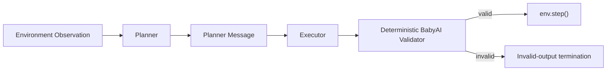
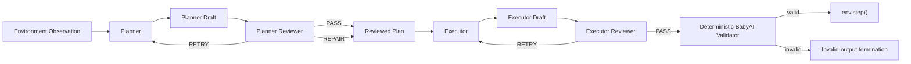
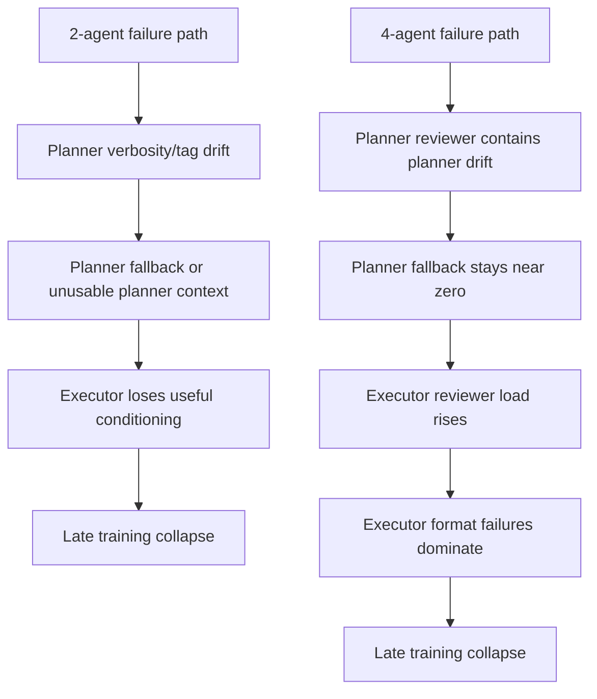

# Proposed Approach Agent Note

Use this file as the primary context pack for drafting the paper's proposed approach section.

## Goal

Document what the experiments actually showed about:

- the original 2-agent shared-policy setup
- the later 4-agent reviewer-gated shared-policy setup
- which failure modes were mitigated
- which failure modes remained
- what claims are supported by the evidence

This file is intentionally evidence-first. It is written so that another LLM can draft a paper section without inventing missing facts.

## Research Objective

The project goal was to improve long-horizon BabyAI performance using a multi-agent decomposition instead of a single-agent policy. Two main shared-policy architectures were explored:

1. `planner_executor`
2. `planner_executor_reviewers`

Both architectures used one underlying model with role-specific prompts, validators, and rollout bookkeeping.

## Architecture Definitions

### 2-Agent Topology: `planner_executor`

Roles:

- `planner`
- `executor`

Design intent:

- Planner emits short strategic guidance.
- Executor converts that guidance into BabyAI-native `Thought:` + `Action:` output.

### 4-Agent Topology: `planner_executor_reviewers`

Roles:

- `planner`
- `planner_reviewer`
- `executor`
- `executor_reviewer`

Design intent:

- Planner can use longer reasoning.
- Planner reviewer decides whether the planner draft should pass, retry, or be repaired.
- Executor sees only reviewer-approved or reviewer-repaired planner context.
- Executor reviewer decides whether the executor output should pass or retry before deterministic BabyAI validation.

### Failure Comparison

## Confirmed 2-Agent Evidence

Source summary:

- `/Users/mavinomichael/PycharmProjects/AgentGym-RL/reports/babyai_multi_agent_diagnostics_2026-03-09/babyai_eval_comparison_report.txt`
- `/Users/mavinomichael/PycharmProjects/AgentGym-RL/reports/babyai_multi_agent_diagnostics_2026-03-10/diagnostic_step60_analysis.txt`
- `/Users/mavinomichael/PycharmProjects/AgentGym-RL/reports/babyai_multi_agent_diagnostics_2026-03-11/eval_step100_diagnostic.log`

### 2-Agent Quantitative Table

| Run | Avg@1 | Pass@1 | ExecutorNativeFormatViolations | InvalidFormatTerminationRate | InvalidActionTerminationRate | PlannerInvalidFormatRate | PlannerFallbackRate | PlannerTagOnlyRate |
|---|---:|---:|---:|---:|---:|---:|---:|---:|
| Base model eval | 0.672827 | 0.733333 | 0.000000 | 0.000000 | 0.088889 | NA | NA | NA |
| 700-step failed eval | 0.000000 | 0.000000 | NA | NA | NA | NA | NA | NA |
| Retrain step-100 | 0.528632 | 0.633333 | 0.366667 | 0.366667 | 0.000000 | NA | NA | NA |
| Sanity step-50 | 0.411854 | 0.433333 | 0.011111 | 0.011111 | 0.000000 | 0.677778 | 0.677778 | 0.000000 |
| Sanity step-15 | 0.722397 | 0.766667 | 0.000000 | 0.000000 | 0.000000 | 0.000000 | 0.000000 | 0.000000 |
| Diagnostic step-100 v2 | 0.657480 | 0.688889 | 0.000000 | 0.000000 | 0.011111 | 0.011111 | 0.011111 | 0.000000 |
| Resume step-236 | 0.431932 | 0.533333 | 0.033333 | 0.033333 | 0.422222 | 1.000000 | 1.000000 | 0.000000 |
| Resume step-350 | -0.200000 | 0.000000 | 1.000000 | 1.000000 | 0.000000 | 1.000000 | 1.000000 | 0.000000 |

### 2-Agent What Worked

- The 2-agent system could improve over the base model early in training.
- `step 15` is the clearest early success:
  - `Avg@1 = 0.722397`
  - `Pass@1 = 0.766667`
  - planner and executor failure metrics were `0`
- The later diagnostic `step 100 v2` showed that planner retries, a lower planner token budget, and planner-weighted KL could keep the system operational:
  - `Avg@1 = 0.657480`
  - `Pass@1 = 0.688889`
  - planner invalid and fallback both stayed near zero

### 2-Agent What Failed

- Long training horizons were unstable.
- Later resumed checkpoints degraded sharply:
  - `step 236`: planner invalid and fallback both at `1.0`
  - `step 350`: both planner and executor collapsed, `Avg@1 = -0.2`
- The key diagnosed onset before those full collapses was planner verbosity drift.

### 2-Agent Diagnosed Failure Onset

From `/Users/mavinomichael/PycharmProjects/AgentGym-RL/reports/babyai_multi_agent_diagnostics_2026-03-10/diagnostic_step60_analysis.txt`:

- first `planner_invalid_format_rate > 0`: `step 45`
- first `planner_fallback_rate > 0`: `step 45`
- dominant planner invalid reason: `too_long`

Representative onset example:

- raw planner output:
  - `Check if there is a red ball in the room or if you need to move to another part of the room.`
- failure mode:
  - planner output became too long for the intended planner contract
- consequence:
  - generic fallback planner context was used instead

Interpretation:

- In the 2-agent setup, the first durable failure was planner-side.
- The planner drifted toward verbose assistant prose, and the executor then lost reliable high-level guidance.

### 2-Agent Secondary Note

There is also a later 2-agent planner-v3 result referenced in local experiment notes:

- `step 100`: `Avg@1 ~= 0.780073`, `Pass@1 ~= 0.833333`

This value is preserved in:

- `/Users/mavinomichael/PycharmProjects/AgentGym-RL/reports/babyai_multi_agent_diagnostics_2026-03-14/reviewer_eval_summary.txt`

However, the standalone raw eval log for that exact checkpoint is not currently archived in the local report set. Use it as a secondary note, not as the main citation if a stricter evidence standard is required.

## Confirmed 4-Agent Evidence

Source summary:

- `/Users/mavinomichael/PycharmProjects/AgentGym-RL/reports/babyai_multi_agent_diagnostics_2026-03-14/reviewer_eval_summary.txt`
- `/Users/mavinomichael/PycharmProjects/AgentGym-RL/reports/babyai_multi_agent_diagnostics_2026-03-14/proposed_approach_evidence.txt`
- `/Users/mavinomichael/PycharmProjects/AgentGym-RL/reports/babyai_multi_agent_diagnostics_2026-03-14/reviewer_run_artifacts/extracted/babyai_reviewers_200_8gpu/trace_train`

### 4-Agent Quantitative Table

| Run | Avg@1 | Pass@1 | ExecutorNativeFormatViolations | InvalidFormatTerminationRate | InvalidActionTerminationRate | PlannerInvalidFormatRate | PlannerFallbackRate | PlannerTagOnlyRate |
|---|---:|---:|---:|---:|---:|---:|---:|---:|
| Reviewer step-50 | 0.739644 | 0.777778 | 0.066667 | 0.066667 | 0.000000 | 0.000000 | 0.000000 | 0.000000 |
| Reviewer step-100 | 0.510516 | 0.533333 | 0.344444 | 0.344444 | 0.022222 | 0.000000 | 0.000000 | 0.033333 |
| Reviewer step-150 | 0.134307 | 0.144444 | 0.566667 | 0.566667 | 0.033333 | 0.000000 | 0.000000 | 0.066667 |

### 4-Agent What Worked

- The early `step 50` checkpoint is strong:
  - `Avg@1 = 0.739644`
  - `Pass@1 = 0.777778`
- Planner reviewer gating kept planner fallback at zero for all evaluated checkpoints.
- Planner invalid format stayed at zero for all evaluated checkpoints.
- This means the reviewer mechanism successfully prevented the specific 2-agent planner-fallback collapse mode from reappearing in eval.

### 4-Agent What Failed

- Performance degraded monotonically after `step 50`.
- The degradation was primarily executor-side:
  - executor format violations rose from `0.066667 -> 0.344444 -> 0.566667`
  - invalid action rate remained smaller than format failure rate
- By `step 150`, the reviewer topology was still keeping planner outputs consumable, but overall task performance had largely collapsed.

### 4-Agent Representative Trace Evidence

#### Example A: clean early nominal path

File:

- `/Users/mavinomichael/PycharmProjects/AgentGym-RL/reports/babyai_multi_agent_diagnostics_2026-03-14/reviewer_run_artifacts/extracted/babyai_reviewers_200_8gpu/trace_train/executor_payload_trace_rank0.jsonl:1`

Facts:

- `training_step = 1`
- planner reviewer verdict: `PASS`
- executor reviewer verdict: `PASS`
- deterministic validation: `ok`
- action sent to env: `turn left`

Why it matters:

- This is the intended best-case execution path of the 4-agent design.

#### Example B: planner repair succeeds

File:

- `/Users/mavinomichael/PycharmProjects/AgentGym-RL/reports/babyai_multi_agent_diagnostics_2026-03-14/reviewer_run_artifacts/extracted/babyai_reviewers_200_8gpu/trace_train/executor_payload_trace_rank0.jsonl:108`

Facts:

- `training_step = 6`
- planner reviewer verdict: `REPAIR`
- planner reviewer reason: `exact_env_action`
- planner review retry count: `5`
- planner repair used: `True`
- reviewed plan used by executor:
  - `Look around and decide next move`
- final executor action: `turn left`

Why it matters:

- This is direct evidence that reviewer repair can salvage planner drafts that violate the planner/executor separation boundary.

#### Example C: executor retry succeeds

File:

- `/Users/mavinomichael/PycharmProjects/AgentGym-RL/reports/babyai_multi_agent_diagnostics_2026-03-14/reviewer_run_artifacts/extracted/babyai_reviewers_200_8gpu/trace_train/executor_payload_trace_rank0.jsonl:228`

Facts:

- `training_step = 11`
- executor reviewer retry count: `1`
- final deterministic validation: `ok`
- final action:
  - `go through red open door 1`

Why it matters:

- This is direct evidence that the executor-review loop can correct some first-pass executor problems.

#### Example D: late executor collapse despite planner repair

File:

- `/Users/mavinomichael/PycharmProjects/AgentGym-RL/reports/babyai_multi_agent_diagnostics_2026-03-14/reviewer_run_artifacts/extracted/babyai_reviewers_200_8gpu/trace_train/executor_payload_trace_rank0.jsonl:805`

Facts:

- `training_step = 101`
- planner reviewer verdict: `REPAIR`
- planner review retry count: `5`
- executor reviewer verdict: `RETRY`
- executor review retry count: `5`
- deterministic validation: `invalid_format`
- executor raw output:
  - `!`
- `env_step_called = False`

Why it matters:

- This is the critical late-stage 4-agent failure mode.
- Planner reviewer gating still keeps planner fallback at zero.
- The executor nevertheless collapses into invalid-format output.

## Cross-Architecture Comparison

### Strongest supported claims

1. Early multi-agent checkpoints can work.
2. The 2-agent system is vulnerable to planner drift and planner fallback.
3. The 4-agent reviewer system reduces planner fallback substantially.
4. The 4-agent reviewer system does not, by itself, prevent executor degradation over longer PPO training.

### Strongest unsupported claims

Do not claim any of the following without additional evidence:

- that the 4-agent topology outperforms the best 2-agent variant overall
- that reviewer gating solves long-horizon stability
- that planner cleanliness implies overall policy health
- that multi-agent PPO alone is sufficient to learn a robust teamwork protocol

## Recommended Proposed-Approach Framing

If another LLM is writing the proposed approach section, the evidence supports this framing:

1. Start from the motivation:
   - long-horizon single-agent control can benefit from decomposition into planning and action roles
2. Explain the first design:
   - a 2-agent shared-policy planner/executor architecture
3. State what the 2-agent evidence showed:
   - early gains were possible
   - the main long-horizon failure was planner-side drift into verbose or unusable planner messages
4. Motivate the revised design:
   - introduce reviewer-gated communication so the executor never consumes raw planner drift directly
5. Explain the second design:
   - a 4-agent shared-policy planner / planner-reviewer / executor / executor-reviewer architecture
6. State the empirical outcome honestly:
   - planner reviewer gating prevented planner fallback collapse
   - executor degradation remained the dominant late-stage failure mode
7. Conclude with the design lesson:
   - reviewer gating is a useful architecture-level safeguard, but additional executor-side stabilization or multi-agent protocol pretraining is likely necessary

## Suggested Drafting Skeleton

Use this as a prompt scaffold for a paper-writing model:

1. Problem statement:
   - single-agent long-horizon decision making is brittle
2. Initial architecture:
   - 2-agent planner/executor shared-policy design
3. Failure diagnosis:
   - planner verbosity drift and fallback collapse
4. Revised architecture:
   - 4-agent reviewer-gated shared-policy design
5. Empirical evidence:
   - strong early checkpoint at reviewer `step 50`
   - monotonic degradation at `step 100` and `step 150`
6. Main lesson:
   - reviewer gating helps planner reliability but does not fully stabilize the executor
7. Proposed next step:
   - role-protocol pretraining or stronger executor-side stabilization

## Source Index

Primary 2-agent summary:

- `/Users/mavinomichael/PycharmProjects/AgentGym-RL/reports/babyai_multi_agent_diagnostics_2026-03-09/babyai_eval_comparison_report.txt`

Planner-drift diagnosis:

- `/Users/mavinomichael/PycharmProjects/AgentGym-RL/reports/babyai_multi_agent_diagnostics_2026-03-10/diagnostic_step60_analysis.txt`

2-agent diagnostic eval:

- `/Users/mavinomichael/PycharmProjects/AgentGym-RL/reports/babyai_multi_agent_diagnostics_2026-03-11/eval_step100_diagnostic.log`

Primary 4-agent summary:

- `/Users/mavinomichael/PycharmProjects/AgentGym-RL/reports/babyai_multi_agent_diagnostics_2026-03-14/reviewer_eval_summary.txt`

4-agent machine-readable metrics:

- `/Users/mavinomichael/PycharmProjects/AgentGym-RL/reports/babyai_multi_agent_diagnostics_2026-03-14/reviewer_stage_metrics.tsv`

4-agent trace evidence:

- `/Users/mavinomichael/PycharmProjects/AgentGym-RL/reports/babyai_multi_agent_diagnostics_2026-03-14/proposed_approach_evidence.txt`
- `/Users/mavinomichael/PycharmProjects/AgentGym-RL/reports/babyai_multi_agent_diagnostics_2026-03-14/reviewer_run_artifacts/extracted/babyai_reviewers_200_8gpu/trace_train`
