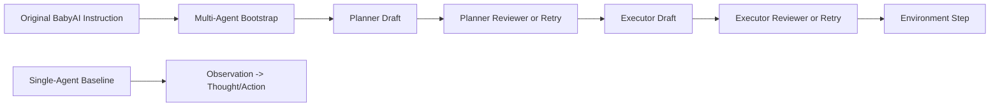

# BabyAI Prompt Alignment: Single-Agent vs Multi-Agent

## Goal
Bring the multi-agent prompting path closer to the original single-agent BabyAI prompt contract before running a ScalingInter-style curriculum ablation.

## Source files
- Single-agent environment prompt: `/Users/mavinomichael/PycharmProjects/AgentGym-RL/AgentGym/agentenv/agentenv/envs/babyai.py`
- Single-agent vanilla prompt asset: `/Users/mavinomichael/PycharmProjects/AgentGym-RL/AgentGym/agentenv-tool/Toolusage/toolusage/prompts/VanillaAgent/babyai_vanilla_prompt.json`
- Multi-agent prompt policy: `/Users/mavinomichael/PycharmProjects/AgentGym-RL/AgentGym-RL/verl/multi_agent/envs/prompt_policy.py`
- Reviewer launcher: `/Users/mavinomichael/PycharmProjects/AgentGym-RL/scripts/multi_agent/run_babyai_reviewers_200_8gpu.sh`
- Scaling reviewer launcher: `/Users/mavinomichael/PycharmProjects/AgentGym-RL/scripts/multi_agent/run_babyai_reviewers_scaling_200_8gpu.sh`

## Single-agent baseline
The original BabyAI contract is minimal:
- system/user instruction says the agent is an exploration master and lists the BabyAI action surface
- assistant acknowledges once
- each turn the environment appends only the latest observation
- the model answers in the native format:
  - `Thought:`
  - `Action:`

The important property is that the task definition is stable. The prompt does not keep restating extra BabyAI-specific repair heuristics on every clean turn.

## Previous multi-agent drift
The earlier multi-agent path had drifted away from the single-agent contract in three ways:
- bootstrap prompt front-loaded a new team-specific instruction block before the original task definition
- planner prompts accumulated BabyAI-specific wording, examples, and phrase constraints that were not part of the original single-agent contract
- executor prompts restated strict BabyAI validation rules on every normal turn, including action-list constraints derived from the observation

That made the runtime more robust in some cases, but it also meant the model was no longer operating under a prompt regime that looked much like the baseline single-agent setup.

## Aligned multi-agent design
The prompt policy now keeps the original task definition primary and treats multi-agent coordination as a thin protocol layer.

### Bootstrap comparison
| Component | Single-agent | Updated multi-agent |
|---|---|---|
| Task definition | Original BabyAI instruction is the task definition | Original BabyAI instruction stays intact and appears first |
| Extra protocol | None | Added after the original instruction: planner guidance, executor is the only env-facing role, reviewers do not change the task definition |
| Output contract | Native BabyAI `Thought`/`Action` | Explicitly says the original action surface and env-facing format remain unchanged |

### Turn-level comparison
| Turn | Single-agent baseline | Updated multi-agent |
|---|---|---|
| Planner turn | N/A | Planner is told to help produce the next valid single-agent response, without changing the task definition |
| Executor turn | Respond to latest observation using native format | Produce the next response exactly as the original single-agent agent would; planner message is advisory only |
| Executor retry | N/A in base prompt; env rejects invalid output | Retry path is still strict and can enumerate allowed actions, but only after an invalid response |
| Reviewer turns | N/A | Reviewers judge conformance to the original single-agent task-native format |

## Why this change matters
This alignment isolates two variables better:
- role decomposition
- curriculum over interaction horizon

Without prompt alignment, a future ScalingInter run would confound:
- multi-agent architecture
- prompt redesign
- turn-scaling curriculum

The current prompt changes reduce that confound by making the normal-path executor behavior look much closer to the single-agent baseline.

## Current implementation details
### Bootstrap
- The original BabyAI instruction is preserved verbatim first.
- Multi-agent protocol is appended after it.
- File: `/Users/mavinomichael/PycharmProjects/AgentGym-RL/AgentGym-RL/verl/multi_agent/envs/prompt_policy.py`

### Planner
- Clean-turn planner prompt is shorter and less over-specified.
- It now explicitly frames the planner as helping the executor produce the next valid single-agent response.
- Retry prompts remain stricter than clean-turn prompts.

### Executor
- Clean-turn executor prompt no longer injects observation-derived action-list constraints.
- It now says to respond exactly as the original single-agent agent would.
- BabyAI-specific action-list constraints remain in the retry path, where they belong as repair guidance rather than baseline task definition.

## ScalingInter-RL plan
We also added a scaling launcher for the 4-agent reviewer path:
- `/Users/mavinomichael/PycharmProjects/AgentGym-RL/scripts/multi_agent/run_babyai_reviewers_scaling_200_8gpu.sh`

Default schedule:
- `algorithm.rounds_ctrl.type=scaling_inter_stepwise`
- `algorithm.rounds_ctrl.steps_scaling_inter=100`
- `algorithm.rounds_ctrl.rounds=[6,13,20]`

Reason for `[6,13,20]` instead of `[10,20,30]`:
- the repo's own BabyAI ScalingInter example uses `[6,13,20]`
- the current BabyAI task config has `default_max_rounds: 20`
- using `[10,20,30]` without separately raising the BabyAI round cap would be inconsistent with the task configuration

## Expected next ablation
Recommended next comparison:
1. aligned prompts + fixed rounds `20`
2. aligned prompts + ScalingInter `[6,13,20]`

Hold constant:
- topology
- batch size
- retry settings
- save checkpoints at `50/100/150/200`

This will tell us whether the late-run degradation was more sensitive to:
- prompt drift from the single-agent baseline
- or missing horizon curriculum

## Diagram

